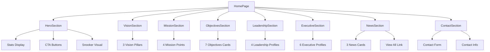

# Design Document: Homepage Redesign V2

## Overview

Complete redesign of all 8 homepage sections for the Jalandhar District Cue Sports Association website with a modern, professional snooker-themed design. The redesign implements a cohesive green-gold-brown color palette inspired by snooker aesthetics (table felt, balls, wood), creating an engaging, accessible, and fully responsive experience.

## Architecture



## Design System

### Color Palette

**Primary (Green - Snooker Table Felt)**
- `primary-50`: #f0fdf4 (lightest)
- `primary-100`: #dcfce7
- `primary-200`: #bbf7d0
- `primary-300`: #86efac
- `primary-400`: #4ade80
- `primary-500`: #22c55e (base)
- `primary-600`: #16a34a (main brand)
- `primary-700`: #15803d
- `primary-800`: #166534
- `primary-900`: #14532d (darkest)

**Accent (Gold - Snooker Balls)**
- `accent-50`: #fefce8
- `accent-100`: #fef9c3
- `accent-200`: #fef08a
- `accent-300`: #fde047
- `accent-400`: #facc15
- `accent-500`: #eab308 (base)
- `accent-600`: #ca8a04 (main accent)
- `accent-700`: #a16207
- `accent-800`: #854d0e
- `accent-900`: #713f12

**Wood (Brown - Wood Tones)**
- `wood-50`: #fdf8f6
- `wood-100`: #f2e8e5
- `wood-200`: #eaddd7
- `wood-300`: #e0cec7
- `wood-400`: #d2bab0
- `wood-500`: #bfa094
- `wood-600`: #a18072
- `wood-700`: #977669
- `wood-800`: #846358
- `wood-900`: #43302b

### Typography

**Font Families**
- Headings: `font-heading` (Poppins)
- Body: `font-sans` (Inter)

**Scale**
- Hero Title: `text-4xl sm:text-5xl md:text-6xl lg:text-7xl`
- Section Headings: `text-3xl sm:text-4xl md:text-5xl lg:text-6xl`
- Subsection Headings: `text-2xl sm:text-3xl md:text-4xl`
- Card Titles: `text-xl sm:text-2xl md:text-3xl`
- Body Text: `text-base sm:text-lg`
- Small Text: `text-sm sm:text-base`

### Spacing

- Section Padding: `py-16 sm:py-20 md:py-24 lg:py-32`
- Container: `container mx-auto px-4 sm:px-6 lg:px-8`
- Card Padding: `p-6 sm:p-8 lg:p-10`
- Grid Gaps: `gap-6 sm:gap-8 lg:gap-10`

### Animations

**Framer Motion / ScrollReveal**
- Fade In: `animation="fade-in"`
- Slide Up: `animation="slide-up"`
- Stagger Delay: `delay={index * 0.1}`

**Hover Effects**
- Scale: `hover:scale-105`
- Translate: `hover:-translate-y-2`
- Shadow: `hover:shadow-2xl`
- Duration: `transition-all duration-300`

## Components and Interfaces

### 1. Hero Section

**Purpose**: Landing area with compelling title, tagline, CTAs, and stats

**Layout**: Full-screen split layout (content left, visual right on desktop)

**Interface**:
```typescript
interface HeroSectionProps {
  title: string
  tagline: string
  ctaText: string
  ctaLink: string
  backgroundImage?: string
}
```

**Design Specifications**:

**Background**
- Gradient: `from-primary-900 via-primary-800 to-wood-900`
- Overlay: Dark overlay with 40% opacity
- Animated gradient pulse effect
- Floating orbs: primary-500/10 and accent-500/10 with blur-3xl

**Content Layout (Left Side - 7 columns)**
- Badge: "Official Association" with green pulse dot
- Title: Large, bold, white text
- Tagline: Blue-100 text, max-w-2xl
- CTA Buttons:
  - Primary: Green button with arrow icon
  - Secondary: Glass-morphism button with white border
- Stats Grid: 3 columns showing Members, Tournaments, Years

**Visual (Right Side - 5 columns)**
- Circular snooker illustration container
- Multi-layer glow effects (emerald, cyan, blue)
- Rotating gradient border rings
- Decorative corner accents (yellow, green, cyan orbs)
- Sparkle effects with ping animation
- Image: Snooker table/balls with hover scale effect

**Scroll Indicator**
- Animated bounce arrow at bottom center
- Hidden on mobile

**Wave Divider**
- SVG wave at bottom transitioning to white

**Responsive Behavior**:
- Mobile: Stack vertically, visual on top
- Tablet: Maintain stack, increase sizes
- Desktop: Side-by-side layout

---

### 2. Vision Section

**Purpose**: Display 3 vision pillars with icons and descriptions

**Layout**: 3-column grid on desktop, single column on mobile

**Interface**:
```typescript
interface VisionPillar {
  title: string
  description: string
  icon?: string
}

interface VisionSectionProps {
  heading: string
  description: string
  pillars: VisionPillar[]
}
```

**Design Specifications**:

**Background**
- Base: White
- Decorative: Gradient blurs (primary-100/20, accent-100/20)
- Trophy pattern overlay at 5% opacity
- Floating geometric shapes (circle, rotated square)

**Header**
- Badge: "Our Vision" in primary-100 background
- Heading: Large, bold, gray-900
- Decorative line: Gradient from primary-600 to accent-500
- Description: Gray-600, max-w-4xl

**Pillar Cards**
- Background: White with shadow-lg
- Border: Gray-100, hover to primary-200
- Gradient accent line on top (scales on hover)
- Icon badge: Numbered 1-3 in gradient circle (primary to accent)
- Decorative circle accent
- Title: Heading font, hover to primary-600
- Description: Gray-600
- "Learn more" arrow (appears on hover)
- Hover effects: Lift up 2px, scale icon, show arrow

**Grid**: `grid-cols-1 md:grid-cols-3 gap-6 sm:gap-8 lg:gap-10`

---

### 3. Mission Section

**Purpose**: Display 4 mission points with emoji icons

**Layout**: 4-column grid on desktop, 2-column on tablet, single on mobile

**Interface**:
```typescript
interface MissionPoint {
  title: string
  description: string
  icon?: string
}

interface MissionSectionProps {
  heading: string
  points: MissionPoint[]
}
```

**Design Specifications**:

**Background**
- Gradient: `from-slate-50 via-gray-50 to-blue-50/30`
- Soft gradient orbs (primary-100/40, accent-100/40)
- Subtle dot pattern at 2% opacity

**Header**
- Badge: "Our Mission" in accent-100 background
- Heading: Gradient text from gray-900 via primary-800 to gray-900
- Decorative line: Gradient from accent-500 to primary-600

**Mission Cards**
- Background: Gradient from gray-50 to white
- Border: 2px gray-100, hover to primary-300
- Hover background: Gradient from primary-50 to accent-50
- Icon badge: Emoji in gradient circle (14-16 size)
- Large number watermark (1-4) in background
- Title: Bold, hover to primary-700
- Description: Gray-600
- Progress bar: Animates on hover (scales from 0 to 100%)
- Decorative corner glow on hover

**Grid**: `grid-cols-1 sm:grid-cols-2 lg:grid-cols-4 gap-6 sm:gap-8`

---

### 4. Objectives Section

**Purpose**: Display 7 objectives in engaging cards

**Layout**: 3-column grid on desktop, 2-column on tablet, single on mobile

**Interface**:
```typescript
interface Objective {
  number: string
  title: string
  description: string
  icon: string
}

interface ObjectivesSectionProps {
  heading: string
  objectives: Objective[]
}
```

**Design Specifications**:

**Background**
- Gradient: `from-blue-600 via-primary-600 to-purple-600`
- Animated pattern overlay at 10% opacity
- Floating orbs with different animation durations

**Header**
- Badge: "Our Goals" with green pulse dot and glass-morphism
- Heading: White, large and bold
- Decorative line: Multi-element with dots and gradients
- Description: Blue-100

**Objective Cards**
- Glowing background effect (emerald, cyan, blue gradient)
- Glass-morphism: White/10 with backdrop-blur
- Border: White/20, hover to emerald-400/50
- Top accent bar: Gradient (emerald, cyan, blue)
- Icon badge: Large emoji in gradient square with shine effect
- Number badge: Yellow-orange gradient circle (orbiting position)
- Title: White, hover to emerald-300
- Description: Blue-100
- Progress bar: Animates on hover
- Arrow icon appears on hover
- Hover effects: Scale up, rotate icon, glow intensifies

**Grid**: `grid-cols-1 md:grid-cols-2 lg:grid-cols-3 gap-6 sm:gap-8`

**Bottom CTA**
- Text: "Ready to be part of our journey?"
- Button: Gradient from emerald-500 to cyan-500 with shadow

---

### 5. Leadership Section

**Purpose**: Display 4 leadership team members with profiles

**Layout**: 4-column grid on desktop, 2-column on tablet, single on mobile

**Interface**:
```typescript
interface Member {
  id: string
  name: string
  role: string
  avatar?: string
  contact?: {
    email?: string
    phone?: string
  }
}

interface LeadershipSectionProps {
  heading: string
  members: Member[]
}
```

**Design Specifications**:

**Background**
- Base: White
- Decorative blurs: Primary-200/20 and accent-200/20

**Header**
- Badge: "Leadership Team" in primary-100
- Heading: Gradient text (primary-600 via primary-700 to accent-600)
- Multi-element decorative divider with dots
- Subtitle: Gray-600

**Member Cards**
- Decorative background: Gradient rotates on hover
- Card: White with shadow-lg, hover shadow-2xl
- Avatar container:
  - Circular with gradient border ring (primary-400 via accent-400 to primary-600)
  - White inner ring
  - Image with hover scale effect
  - Max-width 200px on mobile for better sizing
- Status badge: "⭐ Active" in gradient (primary-600 to accent-500)
- Name: Bold, hover to primary-600
- Role: Primary-600, semibold
- Email: Appears on hover, gray-500
- Decorative line: Scales on hover

**Grid**: `grid-cols-1 sm:grid-cols-2 lg:grid-cols-4 gap-8 sm:gap-10`

---

### 6. Executive Section

**Purpose**: Display 6 executive committee members

**Layout**: 3-column grid on desktop, 2-column on tablet, single on mobile

**Interface**:
```typescript
interface ExecutiveSectionProps {
  heading: string
  members: Member[]
}
```

**Design Specifications**:

**Background**
- Gradient: `from-slate-50 via-gray-50 to-blue-50/30`
- Animated pattern overlay at 5% opacity

**Header**
- Badge: "Executive Team" in accent-100
- Heading: Gradient text (primary-600 via accent-500 to primary-700)
- Multi-element decorative divider with animated pulse dots
- Subtitle: Gray-600

**Member Cards**
- Glow effect: Gradient blur on hover
- Card: White with border-2, hover border-primary-200
- Top accent bar: Gradient scales on hover
- Avatar container:
  - Square with rounded corners (rounded-2xl)
  - Rotating gradient background
  - White frame with shadow
  - Image with hover scale and gradient overlay
- Role badge: Gradient pill showing first word of role
- Name: Bold, hover to primary-600
- Role: Primary-600
- Contact info: Email and phone in gray-50 box, hover to primary-50
- Bottom decorative element: Gradient corner (appears on hover)

**Grid**: `grid-cols-1 sm:grid-cols-2 lg:grid-cols-3 gap-8 sm:gap-10`

---

### 7. News Section

**Purpose**: Display latest 3 news articles with link to full news page

**Layout**: 3-column grid on desktop, single column on mobile

**Interface**:
```typescript
interface NewsArticle {
  id: string
  title: string
  excerpt: string
  date: string
  image?: string
  slug: string
  category?: string
}

interface NewsSectionProps {
  heading: string
  articles: NewsArticle[]
  maxDisplay: number
}
```

**Design Specifications**:

**Background**
- Gradient: `from-white via-gray-50 to-primary-50/20`
- Decorative gradient blurs

**Header**
- Badge: "Latest News" in primary-100
- Heading: Gradient text
- Decorative line
- Subtitle: Gray-600

**News Cards**
- Card: White with shadow-lg, hover shadow-2xl
- Image container:
  - Aspect ratio 16:9
  - Gradient overlay on hover
  - Category badge in top-left corner
- Content padding: p-6
- Date: Small text with calendar icon, primary-600
- Title: Bold, 2 lines max, hover to primary-600
- Excerpt: Gray-600, 3 lines max
- "Read more" link: Primary-600 with arrow, appears on hover
- Hover effects: Lift up, scale image, show overlay

**Grid**: `grid-cols-1 md:grid-cols-2 lg:grid-cols-3 gap-6 sm:gap-8`

**View All Button**
- Centered below grid
- Gradient button (primary-600 to accent-500)
- Arrow icon

---

### 8. Contact Section

**Purpose**: Contact form and information display

**Layout**: 2-column grid on desktop (info left, form right), stack on mobile

**Interface**:
```typescript
interface ContactSectionProps {
  // No props needed - static content
}
```

**Design Specifications**:

**Background**
- Gradient: `from-gray-50 via-white to-gray-50`
- Decorative gradient blurs (primary-100/30, accent-100/30)

**Header**
- Badge: "Get In Touch" in primary-100
- Heading: Gradient text
- Decorative line
- Description: Gray-600

**Contact Information (Left Column)**
- Section title and description
- Contact cards (4 cards):
  - Email card
  - Phone card
  - Address card
  - Office hours card
- Each card:
  - White background with shadow-md, hover shadow-xl
  - Border gray-100, hover to primary-200
  - Icon in gradient circle (primary-600 to accent-500)
  - Icon scales on hover
  - Title and content

**Contact Form (Right Column)**
- Container: White with shadow-xl, rounded-3xl
- Form title
- Success message (green-50 background with checkmark)
- Form fields:
  - Full Name (required)
  - Email Address (required)
  - Phone Number (optional)
  - Subject dropdown (required)
  - Message textarea (required)
- Input styling:
  - Border gray-300
  - Rounded-xl
  - Focus ring primary-500
  - Placeholder text
- Submit button:
  - Full width
  - Gradient (primary-600 to accent-500)
  - Loading spinner when submitting
  - Disabled state styling

**Grid**: `grid-cols-1 lg:grid-cols-2 gap-12 lg:gap-16`

---

## Snooker-Themed Decorative Elements

### Visual Motifs

1. **Circular Elements**: Representing snooker balls
   - Gradient orbs with blur effects
   - Colored dots (green, gold, red, blue)
   - Rotating border rings

2. **Table Felt Texture**: Green gradients
   - Primary color palette dominance
   - Soft green backgrounds
   - Green accent lines

3. **Wood Tones**: Brown accents
   - Wood color palette for borders
   - Warm brown backgrounds in specific sections
   - Natural texture overlays

4. **Ball Colors**: Multi-color accents
   - Red, yellow, green, brown, blue, pink, black
   - Used sparingly in badges and icons
   - Gradient combinations

### Animation Patterns

1. **Float Animation**: Mimics balls rolling
   - Smooth up/down/side movements
   - Applied to decorative orbs
   - Duration: 15-30s

2. **Rotate Animation**: Cue stick rotation
   - Applied to icon badges
   - Subtle 3-6 degree rotation on hover
   - Duration: 300-500ms

3. **Pulse Animation**: Attention indicators
   - Status dots
   - Badge elements
   - Duration: 2-3s

4. **Scale Animation**: Impact effect
   - Hover states on cards
   - Icon interactions
   - Duration: 300ms

---

## Data Models

### Content Structure

```typescript
interface SiteContent {
  hero: {
    title: string
    tagline: string
    ctaText: string
    ctaLink: string
    stats: {
      members: string
      tournaments: string
      years: string
    }
  }
  vision: {
    heading: string
    description: string
    pillars: VisionPillar[]
  }
  mission: {
    heading: string
    points: MissionPoint[]
  }
  objectives: {
    heading: string
    items: Objective[]
  }
  leadership: {
    heading: string
    members: Member[]
  }
  executive: {
    heading: string
    members: Member[]
  }
  news: {
    heading: string
    items: NewsArticle[]
  }
}
```

---

## Correctness Properties

*A property is a characteristic or behavior that should hold true across all valid executions of a system—essentially, a formal statement about what the system should do. Properties serve as the bridge between human-readable specifications and machine-verifiable correctness guarantees.*

### Property 1: Color Palette Consistency

*For all* sections and UI elements, all green tones should be from the primary palette (primary-50 through primary-900), all gold tones should be from the accent palette (accent-50 through accent-900), and all brown tones should be from the wood palette (wood-50 through wood-900).

**Validates: Requirements 10.1, 10.2, 10.3, 10.4, 10.5, 10.6**

### Property 2: Responsive Grid Behavior

*For all* sections with grid layouts, when viewport width is less than 640px, grids should display as single columns; when viewport width is between 640px and 1024px, grids should display as 2 columns where appropriate; when viewport width is greater than 1024px, grids should display as multi-column layouts.

**Validates: Requirements 9.1, 9.2, 9.3**

### Property 3: Section Padding Consistency

*For all* sections, the padding should be py-16 sm:py-20 md:py-24 lg:py-32, and all containers should use px-4 sm:px-6 lg:px-8.

**Validates: Requirements 9.5, 9.6**

### Property 4: Grid Gap Consistency

*For all* grid layouts, the gap spacing should be gap-6 sm:gap-8 lg:gap-10.

**Validates: Requirements 9.7**

### Property 5: Touch Target Minimum Size

*For all* interactive elements (buttons, links, form inputs) on mobile viewports, the touch target size should be minimum 44x44 pixels.

**Validates: Requirements 9.8, 26.8**

### Property 6: Minimum Text Size

*For all* text elements on mobile viewports, the font size should be minimum 16px to ensure readability.

**Validates: Requirements 9.9, 29.3**

### Property 7: Animation Duration Consistency

*For all* transition animations, the duration should be either duration-300 or duration-500, and all hover animations should complete within 300ms.

**Validates: Requirements 11.2, 28.6**

### Property 8: ScrollReveal Animation Stagger

*For all* elements using ScrollReveal animations, the animation delay should be staggered by 0.1s multiplied by the element's index.

**Validates: Requirements 11.3, 11.4**

### Property 9: GPU-Accelerated Animations

*For all* animations, only GPU-accelerated properties (translate, scale, rotate, opacity) should be animated, and layout properties (width, height, top, left) should not be animated.

**Validates: Requirements 11.8, 11.9**

### Property 10: Heading Font Consistency

*For all* heading elements (h1, h2, h3, h4, h5, h6), the font family should be Poppins (font-heading) with bold font weight.

**Validates: Requirements 12.1, 12.9**

### Property 11: Body Text Font Consistency

*For all* body text elements (p, span, div with text content), the font family should be Inter (font-sans) with regular font weight.

**Validates: Requirements 12.2, 12.11**

### Property 12: Section Heading Size Consistency

*For all* section headings, the text size should be text-3xl sm:text-4xl md:text-5xl lg:text-6xl.

**Validates: Requirements 12.4**

### Property 13: Card Title Size Consistency

*For all* card titles, the text size should be text-xl sm:text-2xl md:text-3xl.

**Validates: Requirements 12.6**

### Property 14: Accessibility ARIA Labels

*For all* section elements, there should be an aria-label or aria-labelledby attribute present.

**Validates: Requirements 13.1**

### Property 15: Image Alt Text

*For all* image elements, there should be an alt attribute with descriptive text.

**Validates: Requirements 13.2**

### Property 16: Focus Indicators

*For all* interactive elements (buttons, links, form inputs), when focused, a visible focus indicator should be displayed.

**Validates: Requirements 13.3**

### Property 17: Color Contrast Compliance

*For all* text and background color combinations, the contrast ratio should meet WCAG AA standards (minimum 4.5:1 for normal text).

**Validates: Requirements 13.4**

### Property 18: Keyboard Navigation Support

*For all* interactive elements, keyboard navigation should be supported (Tab, Enter, Space keys).

**Validates: Requirements 13.5**

### Property 19: Form Input Labels

*For all* form input elements, there should be an associated label element.

**Validates: Requirements 13.8**

### Property 20: Form Validation Errors

*For all* invalid form inputs, an error message should be displayed to the user.

**Validates: Requirements 13.9, 17.1, 17.2**

### Property 21: Next.js Image Component Usage

*For all* images, the Next.js Image component should be used instead of standard HTML img tags.

**Validates: Requirements 14.1**

### Property 22: Image Lazy Loading

*For all* images below the fold, the loading attribute should be set to "lazy".

**Validates: Requirements 14.2**

### Property 23: Image Fallback Handling

*For all* images, when the image fails to load, a fallback placeholder image should be displayed.

**Validates: Requirements 14.6, 20.3**

### Property 24: Image Dimensions

*For all* images, width and height attributes should be set to prevent layout shift.

**Validates: Requirements 14.7**

### Property 25: Card Border Radius Consistency

*For all* card elements, the border radius should be either rounded-2xl or rounded-3xl.

**Validates: Requirements 15.1**

### Property 26: Card Shadow Consistency

*For all* card elements, the base shadow should be shadow-lg, and on hover it should increase to shadow-2xl.

**Validates: Requirements 15.2, 15.3**

### Property 27: Card Padding Consistency

*For all* card elements, the padding should be p-6 sm:p-8 lg:p-10.

**Validates: Requirements 15.4**

### Property 28: Card Hover Transform

*For all* card elements, when hovered, a transform effect (scale or translate) should be applied.

**Validates: Requirements 15.7, 28.1**

### Property 29: Section Header Structure

*For all* sections, the header should contain a badge at the top, followed by a heading, then a decorative line, and finally a description text.

**Validates: Requirements 16.1, 16.2, 16.3, 16.4**

### Property 30: Section Header Alignment

*For all* section headers, the content should be center-aligned.

**Validates: Requirements 16.7**

### Property 31: Icon Hover Animation

*For all* icon elements, when hovered, a scale animation should be applied.

**Validates: Requirements 11.5, 28.3**

### Property 32: Link Hover Color

*For all* link elements, when hovered, the text color should change to primary-600.

**Validates: Requirements 28.4**

### Property 33: Button Hover Effects

*For all* button elements, when hovered, scale and shadow effects should be applied.

**Validates: Requirements 28.5**

### Property 34: Form Input Sanitization

*For all* user inputs in forms, the input should be sanitized to prevent XSS attacks before processing.

**Validates: Requirements 30.2**

### Property 35: Member Data Structure

*For all* member objects loaded from content, the object should contain id, name, role, avatar, and contact properties.

**Validates: Requirements 21.8**

### Property 36: News Article Data Structure

*For all* news article objects loaded from content, the object should contain id, title, excerpt, date, image, slug, and category properties.

**Validates: Requirements 21.9**

### Property 37: Text Input Maximum Length

*For all* text input fields in forms, a maximum length limit should be enforced.

**Validates: Requirements 17.8**

---

## Error Handling

### Image Loading Errors

**Condition**: Image fails to load (404, network error)
**Response**: Display fallback placeholder image
**Recovery**: onError handler sets src to placeholder
**Implementation**:
```typescript
onError={(e) => {
  const target = e.target as HTMLImageElement;
  target.src = '/images/placeholders/avatar.svg';
}}
```

### Content Loading Errors

**Condition**: Content JSON fails to load
**Response**: Display error message with details
**Recovery**: Show user-friendly error page with refresh option
**Implementation**: Try-catch in page component with error boundary

### Form Submission Errors

**Condition**: Contact form submission fails
**Response**: Display error message below form
**Recovery**: Allow user to retry submission
**Implementation**: Error state with red-50 background and error icon

---

## Testing Strategy

### Unit Testing Approach

**Component Tests**:
- Test each section component renders correctly
- Test props are passed and displayed
- Test conditional rendering (images, optional fields)
- Test event handlers (form submission, button clicks)

**Snapshot Tests**:
- Capture visual regression for each section
- Test responsive breakpoints
- Test hover states (where possible)

**Coverage Goals**: 80%+ for all section components

### Property-Based Testing Approach

**Property Test Library**: fast-check (for TypeScript/React)

**Properties to Test**:

**P1: Color Palette Validation**
- Generate random color values
- Verify all colors belong to defined palettes
- Test: `∀ color ∈ UsedColors: color ∈ {primary, accent, wood, gray, white, black}`

**P2: Responsive Grid Behavior**
- Generate random viewport widths
- Verify grid columns adjust correctly
- Test: `∀ width ∈ [320, 1920]: gridColumns(width) ∈ ValidColumnCounts`

**P3: Animation Duration Consistency**
- Generate random animation properties
- Verify durations are from allowed set
- Test: `∀ animation ∈ Animations: animation.duration ∈ {300, 500, 1000, 2000, 3000}`

**P4: Content Truncation**
- Generate random text lengths
- Verify text truncates at specified line counts
- Test: `∀ text ∈ CardTexts: lineCount(text) ≤ maxLines`

### Integration Testing Approach

**Page-Level Tests**:
- Test all 8 sections render in correct order
- Test scroll behavior and section navigation
- Test form submission flow
- Test image lazy loading

**Accessibility Tests**:
- Test keyboard navigation through all sections
- Test screen reader compatibility
- Test focus management
- Test ARIA labels and roles

**Performance Tests**:
- Test page load time < 3s
- Test Largest Contentful Paint (LCP) < 2.5s
- Test First Input Delay (FID) < 100ms
- Test Cumulative Layout Shift (CLS) < 0.1

---

## Performance Considerations

### Image Optimization

**Strategy**: Use Next.js Image component with optimization
- Lazy loading for below-fold images
- Responsive image sizes with srcset
- WebP format with fallbacks
- Blur placeholder for loading states

**Implementation**:
```typescript
<Image
  src={imagePath}
  alt={altText}
  width={800}
  height={600}
  loading="lazy"
  placeholder="blur"
/>
```

### Animation Performance

**Strategy**: Use CSS transforms and opacity for animations
- Avoid animating layout properties (width, height, top, left)
- Use transform (translate, scale, rotate) for movement
- Use opacity for fade effects
- Use will-change sparingly for complex animations

**GPU Acceleration**:
- All hover transforms use `transform: translateZ(0)` implicitly
- Framer Motion uses hardware acceleration by default

### Code Splitting

**Strategy**: Lazy load non-critical components
- Sections below fold can be lazy loaded
- Form validation libraries loaded on demand
- Animation libraries loaded with components

### Bundle Size

**Target**: < 200KB initial bundle (gzipped)
- Tree-shake unused Tailwind classes
- Minimize third-party dependencies
- Use dynamic imports for heavy components

---

## Security Considerations

### Form Input Validation

**Client-Side**:
- HTML5 validation (required, email, tel)
- Max length limits on text inputs
- Sanitize input before display

**Server-Side** (when implemented):
- Validate all inputs on backend
- Sanitize to prevent XSS
- Rate limiting on form submissions
- CSRF token validation

### Content Security Policy

**Headers**:
- Restrict script sources to same-origin
- Restrict image sources to trusted domains
- Prevent inline script execution
- Enable XSS protection

### Data Privacy

**Contact Form**:
- No data stored in localStorage
- Clear form after submission
- No tracking without consent
- Secure transmission (HTTPS)

---

## Dependencies

### Core Framework
- Next.js 14 (App Router)
- React 18
- TypeScript 5

### Styling
- Tailwind CSS 3.4
- Custom color configuration (already in tailwind.config.ts)

### Animation
- Framer Motion (for advanced animations)
- ScrollReveal component (already implemented)
- CSS animations (for simple effects)

### UI Components
- Custom components (Button, Card, MemberProfile, NewsCard)
- Already implemented in components/ui/

### Content Management
- JSON-based content (data/content.json)
- Markdown for news articles (data/news/)
- Content loading utilities (lib/content.ts)

### Development Tools
- ESLint (code quality)
- Prettier (code formatting)
- TypeScript (type checking)

### Testing
- Jest (unit testing)
- React Testing Library (component testing)
- fast-check (property-based testing)

---

## Implementation Notes

### Existing Components to Reuse

All section components already exist and follow similar patterns:
- HeroSection.tsx
- VisionSection.tsx
- MissionSection.tsx
- ObjectivesSection.tsx
- LeadershipSection.tsx
- ExecutiveSection.tsx
- NewsSection.tsx
- ContactSection.tsx

### Existing UI Components

Reusable components already implemented:
- Button.tsx (with variants)
- Card.tsx (base card component)
- MemberProfile.tsx (for team members)
- NewsCard.tsx (for news articles)
- ScrollReveal.tsx (animation wrapper)

### Color Scheme Already Updated

The tailwind.config.ts already has the complete color palette:
- Primary (green) - 50 to 950
- Accent (gold) - 50 to 900
- Wood (brown) - 50 to 900

### Content Structure

Content is loaded from:
- data/content.json (main content)
- data/news/ (markdown files for news)
- lib/content.ts (loading utilities)

### Responsive Breakpoints

Tailwind default breakpoints:
- sm: 640px
- md: 768px
- lg: 1024px
- xl: 1280px
- 2xl: 1536px

---

## Design Principles

### 1. Snooker-First Aesthetic
Every design decision reflects snooker culture:
- Green dominates (table felt)
- Gold accents (balls, trophies)
- Brown touches (wood, cues)
- Circular motifs (balls)
- Clean, professional layouts (tournament quality)

### 2. Progressive Enhancement
Start with solid foundation, enhance with interactions:
- Base layout works without JavaScript
- Animations enhance but aren't required
- Images have fallbacks
- Forms work with basic HTML5

### 3. Mobile-First Design
Design for smallest screens first, enhance for larger:
- Single column layouts on mobile
- Touch-friendly targets (min 44x44px)
- Readable text sizes (min 16px)
- Simplified navigation

### 4. Accessibility by Default
Build inclusivity into every component:
- Semantic HTML structure
- ARIA labels where needed
- Keyboard navigation support
- High contrast ratios
- Focus indicators

### 5. Performance Budget
Fast loading is a feature:
- < 3s page load time
- < 200KB initial bundle
- Lazy load below-fold content
- Optimize all images

---

## Visual Design Language

### Card Styles

**Elevated Cards** (Leadership, Executive):
- White background
- Shadow-lg base, shadow-2xl hover
- Rounded-3xl corners
- Border with hover color change
- Lift animation on hover

**Glass-Morphism Cards** (Objectives):
- Semi-transparent background (white/10)
- Backdrop blur effect
- Border with transparency
- Glow effect on hover
- Vibrant on dark backgrounds

**Gradient Cards** (Mission):
- Subtle gradient backgrounds
- Stronger gradient on hover
- Smooth color transitions
- Depth through layering

### Icon Treatments

**Gradient Circles**:
- Primary to accent gradient
- Shadow for depth
- Rotate on hover
- Scale animation

**Badge Styles**:
- Rounded-full pills
- Uppercase text
- Colored backgrounds
- Pulse animations for status

### Text Treatments

**Gradient Text**:
- bg-gradient-to-r
- bg-clip-text
- text-transparent
- Used for major headings

**Hierarchy**:
- Bold weights for headings
- Semibold for subheadings
- Regular for body text
- Color contrast for emphasis

---

## Conclusion

This design document provides comprehensive specifications for redesigning all 8 homepage sections with a cohesive snooker-themed aesthetic. The design leverages the existing color palette (green, gold, brown), maintains consistency across all sections, ensures full responsiveness, and prioritizes accessibility and performance.

The implementation will build upon existing components and patterns while introducing enhanced visual treatments, animations, and snooker-inspired decorative elements throughout.
