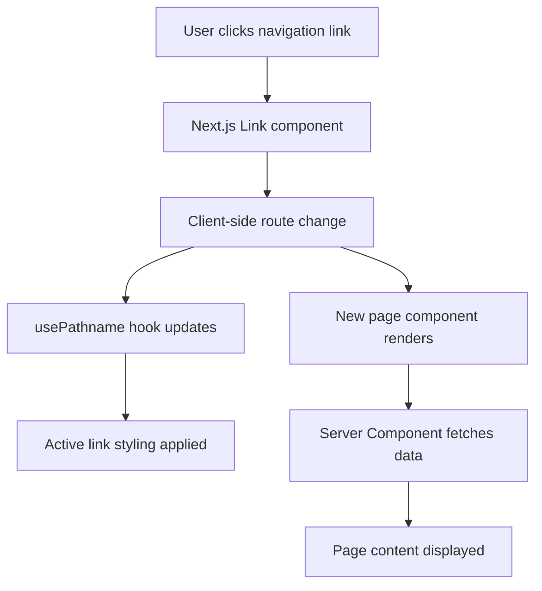
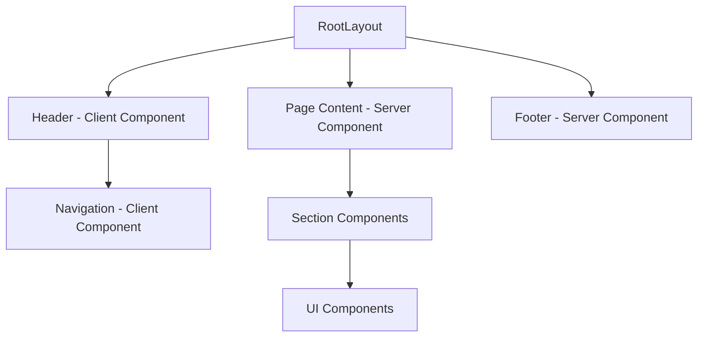

# Design Document: Multi-Page Navigation

## Overview

This design document specifies the technical implementation for converting the existing single-page sports association website into a multi-page application using Next.js 14 App Router. The conversion transforms anchor-based navigation (#hash links) into proper route-based navigation while preserving all existing functionality, styling, animations, and accessibility features.

### Current State

The website currently operates as a single-page application (SPA) with:
- All sections rendered on a single route (`/`)
- Navigation using anchor links (`#hero`, `#vision`, etc.)
- Scroll-based active section detection
- A transparent header that changes on scroll
- All content loaded on initial page load

### Target State

The redesigned website will:
- Use dedicated routes for each major section (`/`, `/vision`, `/mission`, etc.)
- Implement Next.js Link components for client-side navigation
- Detect active routes using Next.js pathname
- Maintain the transparent header behavior on the home page
- Load content per-page using Server Components where possible
- Preserve all animations, styling, and accessibility features

### Key Technical Decisions

1. **App Router over Pages Router**: Use Next.js 14 App Router for modern React Server Components support
2. **Shared Layout Pattern**: Implement a root layout with Header and Footer to avoid duplication
3. **Server Components by Default**: Use Server Components for pages, Client Components only where interactivity is needed
4. **usePathname for Active Routes**: Replace scroll-based detection with pathname-based detection
5. **Metadata API**: Use Next.js 14 Metadata API for per-page SEO
6. **Image Component Migration**: Replace img tags with Next.js Image component to fix onError handler issues

## Architecture

### Directory Structure

```
app/
├── layout.tsx                 # Root layout (existing)
├── page.tsx                   # Home page (modified)
├── vision/
│   └── page.tsx              # Vision page (new)
├── mission/
│   └── page.tsx              # Mission page (new)
├── leadership/
│   └── page.tsx              # Leadership page (new)
├── executive/
│   └── page.tsx              # Executive page (new)
├── news/
│   ├── page.tsx              # News listing page (new)
│   └── [slug]/
│       └── page.tsx          # News detail page (existing)
├── contact/
│   └── page.tsx              # Contact page (new)
└── not-found.tsx             # 404 page (existing)

components/
├── layout/
│   ├── Header.tsx            # Modified for route-based navigation
│   ├── Navigation.tsx        # Modified for route-based navigation
│   └── Footer.tsx            # Unchanged
└── sections/
    ├── HeroSection.tsx       # Unchanged
    ├── VisionSection.tsx     # Unchanged
    ├── MissionSection.tsx    # Unchanged
    ├── LeadershipSection.tsx # Unchanged
    ├── ExecutiveSection.tsx  # Unchanged
    ├── NewsSection.tsx       # Unchanged
    └── ContactSection.tsx    # Unchanged
```

### Navigation Flow



### Component Hierarchy



## Components and Interfaces

### Modified Components

#### 1. Header Component

**File**: `components/layout/Header.tsx`

**Changes**:
- Replace `` with Next.js `<Image>` component to fix onError handler issue
- Pass `currentPath` prop from parent to enable route-based active detection
- Remove scroll-based section detection logic
- Maintain transparent header behavior (controlled by page-level prop)

**Interface**:
```typescript
interface HeaderProps {
  transparent?: boolean
  currentPath?: string  // New prop for active route detection
}
```

**Key Implementation Details**:
- Use `next/image` Image component with proper width/height
- Remove onError handler (Next.js Image handles errors internally)
- Pass currentPath to Navigation component

#### 2. Navigation Component

**File**: `components/layout/Navigation.tsx`

**Changes**:
- Replace anchor links with Next.js Link components
- Update navLinks array to use route paths instead of hash links
- Replace scroll-based active detection with pathname comparison
- Remove smooth scroll behavior (handled by browser navigation)
- Add Contact link to navigation

**Interface**:
```typescript
interface NavigationProps {
  isScrolled?: boolean
  transparent?: boolean
  currentPath?: string  // New prop for active route detection
}

const navLinks = [
  { href: '/', label: 'Home' },
  { href: '/vision', label: 'Vision' },
  { href: '/mission', label: 'Mission' },
  { href: '/leadership', label: 'Leadership' },
  { href: '/executive', label: 'Executive' },
  { href: '/news', label: 'News' },
  { href: '/contact', label: 'Contact' },
]
```

**Key Implementation Details**:
- Use `Link` from `next/link` for all navigation items
- Compare `currentPath` with `link.href` for active state
- Maintain mobile menu functionality
- Preserve hover and focus states

#### 3. Page Layout Wrapper

**New Component**: `components/layout/PageLayout.tsx`

**Purpose**: Provide a consistent wrapper for all pages with Header and Footer

**Interface**:
```typescript
interface PageLayoutProps {
  children: React.ReactNode
  transparent?: boolean  // For home page hero section
}
```

**Implementation**:
```typescript
'use client'

import { usePathname } from 'next/navigation'
import { Header } from './Header'
import { Footer } from './Footer'

export function PageLayout({ children, transparent = false }: PageLayoutProps) {
  const pathname = usePathname()
  
  return (
    <>
      <Header transparent={transparent} currentPath={pathname} />
      <main role="main" className="relative">
        {children}
      </main>
      <Footer {...footerProps} />
    </>
  )
}
```

### New Page Components

#### 1. Home Page (`app/page.tsx`)

**Type**: Server Component

**Responsibilities**:
- Render HeroSection only
- Load hero content from data source
- Use PageLayout with transparent header

**Data Loading**:
```typescript
const content = await getSiteContent()
```

#### 2. Vision Page (`app/vision/page.tsx`)

**Type**: Server Component

**Responsibilities**:
- Render VisionSection
- Load vision content from data source
- Use PageLayout with solid header

**Metadata**:
```typescript
export const metadata: Metadata = {
  title: 'Our Vision',
  description: 'Discover the vision of Jalandhar District Cue Sports Association...',
}
```

#### 3. Mission Page (`app/mission/page.tsx`)

**Type**: Server Component

**Responsibilities**:
- Render MissionSection
- Load mission content from data source

#### 4. Leadership Page (`app/leadership/page.tsx`)

**Type**: Server Component

**Responsibilities**:
- Render LeadershipSection
- Load leadership members from data source

#### 5. Executive Page (`app/executive/page.tsx`)

**Type**: Server Component

**Responsibilities**:
- Render ExecutiveSection
- Load executive members from data source

#### 6. News Page (`app/news/page.tsx`)

**Type**: Server Component

**Responsibilities**:
- Render NewsSection without maxDisplay limit
- Load all news articles from data source
- Maintain links to individual article pages

#### 7. Contact Page (`app/contact/page.tsx`)

**Type**: Server Component (wrapping Client Component)

**Responsibilities**:
- Render ContactSection
- Handle form submission (client-side)

## Data Models

### Navigation Link Model

```typescript
interface NavLink {
  href: string      // Route path (e.g., '/', '/vision')
  label: string     // Display text (e.g., 'Home', 'Vision')
}
```

### Page Metadata Model

```typescript
interface PageMetadata {
  title: string
  description: string
  keywords?: string[]
  openGraph?: {
    title: string
    description: string
    images: string[]
  }
}
```

### Existing Data Models

All existing data models remain unchanged:
- `SiteContent` from `lib/types.ts`
- `LeadershipMember` from `lib/types.ts`
- `ExecutiveMember` from `lib/types.ts`
- `NewsArticle` from `lib/types.ts`

## Implementation Strategy

### Phase 1: Layout Infrastructure

1. Create PageLayout component with usePathname integration
2. Update Header to accept currentPath prop
3. Update Navigation to use Link components and pathname-based active detection
4. Fix Header image onError issue using Next.js Image component

### Phase 2: Page Creation

1. Modify home page to render only HeroSection
2. Create vision page with VisionSection
3. Create mission page with MissionSection
4. Create leadership page with LeadershipSection
5. Create executive page with ExecutiveSection
6. Create news listing page with all articles
7. Create contact page with ContactSection

### Phase 3: Metadata and SEO

1. Add metadata exports to each page
2. Update sitemap.ts to include new routes
3. Verify OpenGraph tags for each page

### Phase 4: Testing and Validation

1. Test navigation between all pages
2. Verify active link highlighting
3. Test responsive behavior on all pages
4. Verify accessibility (keyboard navigation, screen readers)
5. Test transparent header on home page
6. Verify all animations work on page load


## Correctness Properties

*A property is a characteristic or behavior that should hold true across all valid executions of a system-essentially, a formal statement about what the system should do. Properties serve as the bridge between human-readable specifications and machine-verifiable correctness guarantees.*

### Property Reflection

After analyzing all acceptance criteria, I identified several areas of redundancy:

1. **Route existence tests (1.1-1.7, 4.1-4.7, 6.1-6.7)**: These can be combined into a single property that validates all routes render correctly with appropriate content and metadata.

2. **Layout persistence (5.1-5.4)**: Header and footer persistence can be combined into a single property about layout consistency.

3. **Responsive behavior (7.1-7.4)**: All responsive requirements can be validated by a single property about responsive design across all pages.

4. **Accessibility requirements (8.1-8.4)**: These can be combined into a comprehensive accessibility property.

5. **Styling preservation (9.1-9.2, 9.4)**: Animation and styling preservation can be combined into a single property.

6. **Data loading (13.1-13.2)**: These can be combined into a single property about data loading consistency.

The following properties represent the unique, non-redundant validation requirements:

### Property 1: Route-to-Content Mapping

*For any* defined route in the navigation system (`/`, `/vision`, `/mission`, `/leadership`, `/executive`, `/news`, `/contact`), navigating to that route should render the corresponding section component with appropriate content loaded from the data source.

**Validates: Requirements 1.1, 1.2, 1.3, 1.4, 1.5, 1.6, 1.7, 4.1, 4.2, 4.3, 4.4, 4.5, 4.6, 4.7, 13.1, 13.2**

### Property 2: Client-Side Navigation

*For any* navigation link in the header, clicking that link should navigate to the corresponding route without triggering a full page reload (client-side navigation).

**Validates: Requirements 2.3**

### Property 3: Layout Consistency

*For any* page in the application, both the Header component and Footer component should be present and maintain consistent structure, styling, and state across navigation.

**Validates: Requirements 2.4, 5.1, 5.2, 5.3, 5.4**

### Property 4: Active Route Indication

*For any* route that has a corresponding navigation menu item, when a user is on that route, the navigation menu should visually highlight that item with distinct styling, and this highlighting should update immediately when the route changes.

**Validates: Requirements 3.1, 3.2, 3.3**

### Property 5: SEO Metadata Uniqueness

*For any* page in the application, that page should have a unique page title and meta description that accurately describes its content.

**Validates: Requirements 6.1, 6.2, 6.3, 6.4, 6.5, 6.6, 6.7**

### Property 6: Responsive Design Preservation

*For any* page and any viewport size (mobile, tablet, desktop), the navigation system and section components should maintain responsive layout behavior with appropriate breakpoint-specific styling.

**Validates: Requirements 7.1, 7.4**

### Property 7: Accessibility Compliance

*For any* interactive element in the navigation system, that element should be keyboard accessible, have appropriate ARIA labels and roles, be screen reader compatible, and maintain WCAG-compliant color contrast ratios.

**Validates: Requirements 8.1, 8.2, 8.3, 8.4**

### Property 8: Animation and Styling Preservation

*For any* section component on any page, that component should preserve its original scroll reveal animations, Tailwind CSS styling, and interactive states (hover, focus) from the single-page version.

**Validates: Requirements 9.1, 9.2, 9.4**

### Property 9: Smooth Page Transitions

*For any* navigation between pages, the transition should be smooth without jarring visual changes or layout shifts.

**Validates: Requirements 9.3**

### Property 10: News Card Functionality

*For any* news article displayed on the news page, the article should render using the NewsCard component with correct styling, and clicking the article should navigate to its detail page.

**Validates: Requirements 11.3, 11.4**

### Property 11: Form Validation

*For any* contact form submission, the form should validate the input data, and if validation fails, display appropriate error messages to the user.

**Validates: Requirements 12.3, 12.4**

### Property 12: Contact Form Responsiveness

*For any* viewport size, the contact section should maintain a responsive layout with properly sized and positioned form fields.

**Validates: Requirements 12.5**

### Property 13: Component Type Correctness

*For any* page component that can be a Server Component (no client-side interactivity), it should be implemented as a Server Component, and for any component requiring client-side interactivity, it should be marked as a Client Component.

**Validates: Requirements 13.3, 13.4**

### Property 14: Dynamic Route Preservation

*For any* news article with a slug, the dynamic route `/news/[slug]` should render the article detail page correctly, and the sitemap should include all valid routes.

**Validates: Requirements 14.1, 14.2, 14.3**

### Property 15: 404 Error Handling

*For any* invalid route that doesn't match defined pages, the application should display the 404 not-found page.

**Validates: Requirements 14.4**

## Error Handling

### Navigation Errors

**Scenario**: User navigates to a route that fails to load content

**Handling**:
- Implement error boundaries at the page level
- Display user-friendly error message with retry option
- Log error details for debugging
- Maintain header and footer even in error state

**Implementation**:
```typescript
// app/error.tsx
'use client'

export default function Error({
  error,
  reset,
}: {
  error: Error & { digest?: string }
  reset: () => void
}) {
  return (
    <div className="min-h-screen flex items-center justify-center">
      <div className="text-center">
        <h2>Something went wrong!</h2>
        <button onClick={() => reset()}>Try again</button>
      </div>
    </div>
  )
}
```

### Image Loading Errors

**Scenario**: Header logo image fails to load

**Handling**:
- Use Next.js Image component which handles errors internally
- Provide fallback alt text for accessibility
- No custom onError handlers needed (prevents build errors)

**Implementation**:
```typescript
<Image
  src="/images/hero/snooker-logo-final.png"
  alt="JDCSA Logo"
  width={64}
  height={64}
  className="object-contain"
  priority
/>
```

### Data Loading Errors

**Scenario**: Content fails to load from data source

**Handling**:
- Implement try-catch in Server Components
- Return error state to error boundary
- Provide meaningful error messages
- Allow retry mechanism

### Form Submission Errors

**Scenario**: Contact form submission fails

**Handling**:
- Validate input on client-side before submission
- Display field-specific error messages
- Maintain form state on error
- Provide clear guidance for correction

### 404 Errors

**Scenario**: User navigates to non-existent route

**Handling**:
- Use existing `app/not-found.tsx` component
- Provide navigation back to home
- Maintain consistent layout with header/footer
- Log 404 occurrences for monitoring

## Testing Strategy

### Dual Testing Approach

This feature requires both unit tests and property-based tests to ensure comprehensive coverage:

- **Unit tests**: Verify specific examples, edge cases, and error conditions
- **Property tests**: Verify universal properties across all inputs

Both approaches are complementary and necessary. Unit tests catch concrete bugs in specific scenarios, while property tests verify general correctness across many inputs.

### Unit Testing

**Focus Areas**:
1. Specific route rendering (e.g., "/" renders HeroSection)
2. Navigation component Link usage (no anchor tags)
3. Header image component migration (uses Next.js Image)
4. Metadata presence on specific pages
5. Mobile menu toggle functionality
6. Form field validation rules
7. Error boundary activation
8. 404 page rendering for invalid routes

**Example Unit Tests**:
```typescript
// Test specific route rendering
describe('Home Page', () => {
  it('should render HeroSection component', async () => {
    const page = await HomePage()
    render(page)
    expect(screen.getByRole('heading', { name: /welcome/i })).toBeInTheDocument()
  })
})

// Test navigation component structure
describe('Navigation', () => {
  it('should use Next.js Link components', () => {
    render(<Navigation currentPath="/" />)
    const links = screen.getAllByRole('link')
    links.forEach(link => {
      expect(link).not.toHaveAttribute('href', expect.stringContaining('#'))
    })
  })
})

// Test metadata
describe('Vision Page Metadata', () => {
  it('should have unique title and description', () => {
    expect(metadata.title).toBe('Our Vision')
    expect(metadata.description).toContain('vision')
  })
})
```

**Test Configuration**:
- Use Jest with React Testing Library
- Use jest-axe for accessibility testing
- Mock Next.js navigation hooks (usePathname, useRouter)
- Mock data loading functions

### Property-Based Testing

**Library**: fast-check (already in package.json)

**Configuration**: Minimum 100 iterations per property test

**Focus Areas**:
1. Route-to-content mapping across all routes
2. Layout consistency across all pages
3. Active route indication for all navigation items
4. Responsive behavior across viewport sizes
5. Accessibility compliance for all interactive elements
6. Animation preservation across all sections
7. Form validation across various inputs

**Example Property Tests**:

```typescript
import fc from 'fast-check'

/**
 * Feature: multi-page-navigation, Property 1: Route-to-Content Mapping
 * For any defined route, navigating should render corresponding content
 */
describe('Property 1: Route-to-Content Mapping', () => {
  const routes = ['/', '/vision', '/mission', '/leadership', '/executive', '/news', '/contact']
  
  it('should render appropriate content for any route', () => {
    fc.assert(
      fc.property(
        fc.constantFrom(...routes),
        async (route) => {
          const response = await fetch(`http://localhost:3000${route}`)
          expect(response.status).toBe(200)
          const html = await response.text()
          expect(html).toContain('<!DOCTYPE html>')
          expect(html.length).toBeGreaterThan(0)
        }
      ),
      { numRuns: 100 }
    )
  })
})

/**
 * Feature: multi-page-navigation, Property 4: Active Route Indication
 * For any route with a nav item, that item should be highlighted
 */
describe('Property 4: Active Route Indication', () => {
  const routeNavPairs = [
    { route: '/', label: 'Home' },
    { route: '/vision', label: 'Vision' },
    { route: '/mission', label: 'Mission' },
    { route: '/leadership', label: 'Leadership' },
    { route: '/executive', label: 'Executive' },
    { route: '/news', label: 'News' },
    { route: '/contact', label: 'Contact' },
  ]
  
  it('should highlight the active navigation item for any route', () => {
    fc.assert(
      fc.property(
        fc.constantFrom(...routeNavPairs),
        ({ route, label }) => {
          render(<Navigation currentPath={route} />)
          const activeLink = screen.getByRole('link', { name: label })
          expect(activeLink).toHaveClass('border-primary-600') // or appropriate active class
        }
      ),
      { numRuns: 100 }
    )
  })
})

/**
 * Feature: multi-page-navigation, Property 6: Responsive Design Preservation
 * For any page and viewport size, layout should be responsive
 */
describe('Property 6: Responsive Design Preservation', () => {
  const viewportSizes = [
    { width: 375, height: 667, name: 'mobile' },
    { width: 768, height: 1024, name: 'tablet' },
    { width: 1920, height: 1080, name: 'desktop' },
  ]
  
  it('should maintain responsive layout at any viewport size', () => {
    fc.assert(
      fc.property(
        fc.constantFrom(...viewportSizes),
        ({ width, height }) => {
          global.innerWidth = width
          global.innerHeight = height
          global.dispatchEvent(new Event('resize'))
          
          render(<Navigation currentPath="/" />)
          const nav = screen.getByRole('navigation')
          expect(nav).toBeInTheDocument()
          
          if (width < 768) {
            // Mobile: menu button should be visible
            expect(screen.getByLabelText(/toggle menu/i)).toBeVisible()
          } else {
            // Desktop: nav links should be visible
            expect(screen.getByRole('link', { name: /home/i })).toBeVisible()
          }
        }
      ),
      { numRuns: 100 }
    )
  })
})

/**
 * Feature: multi-page-navigation, Property 11: Form Validation
 * For any form submission, validation should occur
 */
describe('Property 11: Form Validation', () => {
  it('should validate any form input and show errors for invalid data', () => {
    fc.assert(
      fc.property(
        fc.record({
          name: fc.string(),
          email: fc.string(),
          message: fc.string(),
        }),
        async (formData) => {
          render(<ContactSection />)
          
          const nameInput = screen.getByLabelText(/name/i)
          const emailInput = screen.getByLabelText(/email/i)
          const messageInput = screen.getByLabelText(/message/i)
          
          await userEvent.type(nameInput, formData.name)
          await userEvent.type(emailInput, formData.email)
          await userEvent.type(messageInput, formData.message)
          
          const submitButton = screen.getByRole('button', { name: /submit/i })
          await userEvent.click(submitButton)
          
          // Validation should occur
          const isValidEmail = /^[^\s@]+@[^\s@]+\.[^\s@]+$/.test(formData.email)
          const isValidName = formData.name.trim().length > 0
          const isValidMessage = formData.message.trim().length > 0
          
          if (!isValidEmail || !isValidName || !isValidMessage) {
            // Should show error messages
            expect(screen.queryByText(/error/i)).toBeInTheDocument()
          }
        }
      ),
      { numRuns: 100 }
    )
  })
})
```

### Integration Testing

**Focus Areas**:
1. End-to-end navigation flow
2. Data loading and rendering pipeline
3. Form submission workflow
4. Error boundary behavior
5. SEO metadata rendering

**Tools**:
- Playwright or Cypress for E2E tests
- Test against development server
- Verify actual browser behavior

### Accessibility Testing

**Focus Areas**:
1. Keyboard navigation through all routes
2. Screen reader announcements
3. ARIA label correctness
4. Color contrast verification
5. Focus management

**Tools**:
- jest-axe for automated accessibility testing
- Manual testing with screen readers (NVDA, JAWS, VoiceOver)
- Keyboard-only navigation testing

### Performance Testing

**Focus Areas**:
1. Page load times for each route
2. Client-side navigation speed
3. Image loading optimization
4. Bundle size impact

**Tools**:
- Lighthouse CI
- Next.js built-in performance metrics
- Chrome DevTools Performance tab

### Visual Regression Testing

**Focus Areas**:
1. Header appearance on all pages
2. Section component styling preservation
3. Responsive layout at various breakpoints
4. Animation behavior

**Tools**:
- Percy or Chromatic for visual regression
- Screenshot comparison tests

## Migration Path

### Step 1: Preparation
1. Create feature branch
2. Backup current working state
3. Review all existing tests
4. Document current navigation behavior

### Step 2: Infrastructure Changes
1. Create PageLayout component
2. Update Header to use Next.js Image
3. Update Navigation to use Link components
4. Add usePathname for active route detection

### Step 3: Page Creation
1. Modify home page (only HeroSection)
2. Create vision page
3. Create mission page
4. Create leadership page
5. Create executive page
6. Create news listing page
7. Create contact page

### Step 4: Metadata Addition
1. Add metadata to each page
2. Update sitemap.ts
3. Verify OpenGraph tags

### Step 5: Testing
1. Run unit tests
2. Run property-based tests
3. Run accessibility tests
4. Manual testing of all routes
5. Visual regression testing

### Step 6: Deployment
1. Build production bundle
2. Verify no build errors
3. Test on staging environment
4. Deploy to production
5. Monitor for errors

## Risks and Mitigations

### Risk 1: Breaking Existing News Routes

**Impact**: High - Existing bookmarks and search engine links could break

**Mitigation**:
- Preserve `/news/[slug]` route structure
- Test all existing news article links
- Verify sitemap includes all routes
- Implement redirects if needed

### Risk 2: Animation Timing Issues

**Impact**: Medium - Animations might not trigger correctly on page load

**Mitigation**:
- Test scroll reveal animations on each page
- Ensure IntersectionObserver works correctly
- Add fallback for browsers without IntersectionObserver support

### Risk 3: SEO Impact

**Impact**: High - Poor metadata could hurt search rankings

**Mitigation**:
- Write unique, descriptive metadata for each page
- Test OpenGraph tags with validators
- Submit updated sitemap to search engines
- Monitor search console for issues

### Risk 4: Performance Regression

**Impact**: Medium - Multiple pages could increase bundle size

**Mitigation**:
- Use Server Components where possible
- Implement code splitting
- Monitor bundle size with Next.js analyzer
- Optimize images with Next.js Image component

### Risk 5: Accessibility Regression

**Impact**: High - Navigation changes could break accessibility

**Mitigation**:
- Run jest-axe on all pages
- Test keyboard navigation thoroughly
- Test with screen readers
- Maintain ARIA labels and roles

## Success Criteria

The multi-page navigation implementation will be considered successful when:

1. All 7 routes render correctly with appropriate content
2. Navigation uses Next.js Link components (no anchor links)
3. Active route is visually indicated in navigation
4. All pages have unique SEO metadata
5. Header and Footer appear consistently on all pages
6. Responsive design works at all breakpoints
7. All accessibility tests pass
8. All animations and styling are preserved
9. Form validation works correctly
10. All property-based tests pass (100+ iterations each)
11. Build completes without errors
12. No console errors in browser
13. Lighthouse scores remain high (>90 for all metrics)
14. Existing news article routes continue to work

## Appendix

### Technology Stack

- **Framework**: Next.js 14.2.0
- **React**: 18.3.0
- **Styling**: Tailwind CSS 3.4.0
- **Animations**: Framer Motion 11.0.0
- **Testing**: Jest 30.2.0, React Testing Library 16.3.2, fast-check 4.5.3
- **Accessibility**: jest-axe 10.0.0

### Key Dependencies

- `next/link`: Client-side navigation
- `next/navigation`: usePathname hook for active route detection
- `next/image`: Optimized image loading
- `next/metadata`: SEO metadata API

### Reference Documentation

- [Next.js 14 App Router Documentation](https://nextjs.org/docs/app)
- [Next.js Link Component](https://nextjs.org/docs/app/api-reference/components/link)
- [Next.js usePathname Hook](https://nextjs.org/docs/app/api-reference/functions/use-pathname)
- [Next.js Metadata API](https://nextjs.org/docs/app/api-reference/functions/generate-metadata)
- [Next.js Image Component](https://nextjs.org/docs/app/api-reference/components/image)
- [WCAG 2.1 Guidelines](https://www.w3.org/WAI/WCAG21/quickref/)
- [fast-check Documentation](https://fast-check.dev/)

